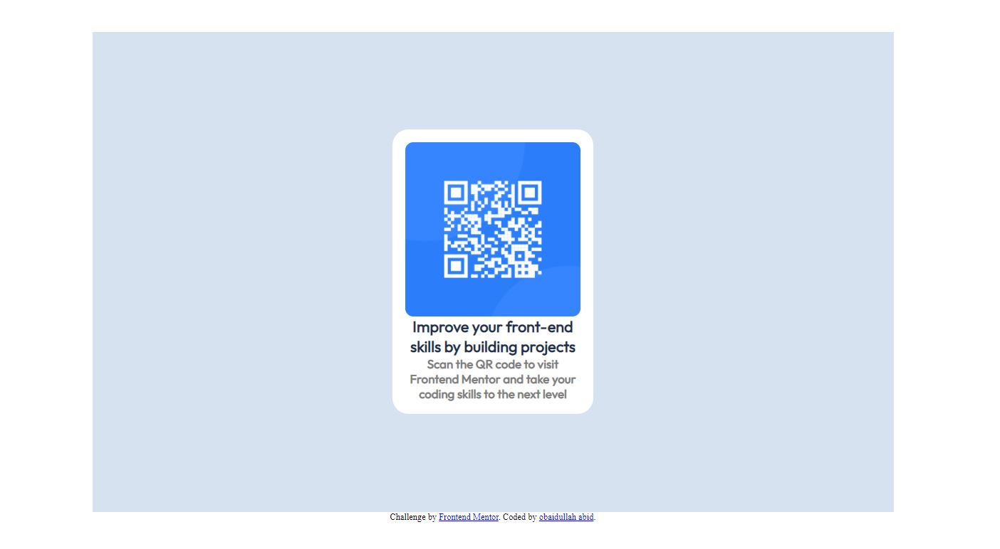

# Frontend Mentor - QR code component solution

## Table of contents

- [Overview](#overview)
  - [Screenshot](#screenshot)
  - [Links](#links)
- [My process](#my-process)
  - [Built with](#built-with)
  - [What I learned](#what-i-learned)
  - [Continued development](#continued-development)
  - [Useful resources](#useful-resources)
  - [AI Collaboration](#ai-collaboration)
- [Author](#author)

## Overview

### Screenshot

screenshot of QR code challange is bellow

### Links

- Solution URL: [Add solution URL here](http://127.0.0.1:5500/frontend-mentor-practice/qr-code-component-main/index.html#)
- Live Site URL: [Add live site URL here](https://obaidullah-abid.github.io/frontend-mentor-practice/)

## My process

### Built with

- Semantic HTML5 markup
- CSS custom properties
- Flexbox

### What I learned

i learned that how to make html structure for this kind project paice

and also the bellow paice of project ware very helpol. for that i should use article inside div.
'''

<article class="card">

<h1>Improve your front-end skills by building projects</h1>

Scan the QR code to visit Frontend Mentor and take your coding
skills to the next level

</article>

'''
and the belllow css code is also helpol for good designing
'''
body {
padding: 0;
margin: 0;
box-sizing: border-box;
}
'''

### Continued development

my focusing area will be both good structure of html and css style.

### Useful resources

good resources ware my lacture note that i write from my teacher and it is in hard at my note book

### AI Collaboration

i use chatgpt tools and it wase just for brainstoming and it was good and i learned that which element i use and whare like article ,section ans so on.

## Author

- Website - [obaidullah abid](obaidullahabid98@gmail.com)
- Frontend Mentor - [@obaidullah abid](https://www.frontendmentor.io/profile/obaidullah)
- Twitter - [@obaidullahabed3](https://www.@obaidullahabed3.com/obaidullah)
